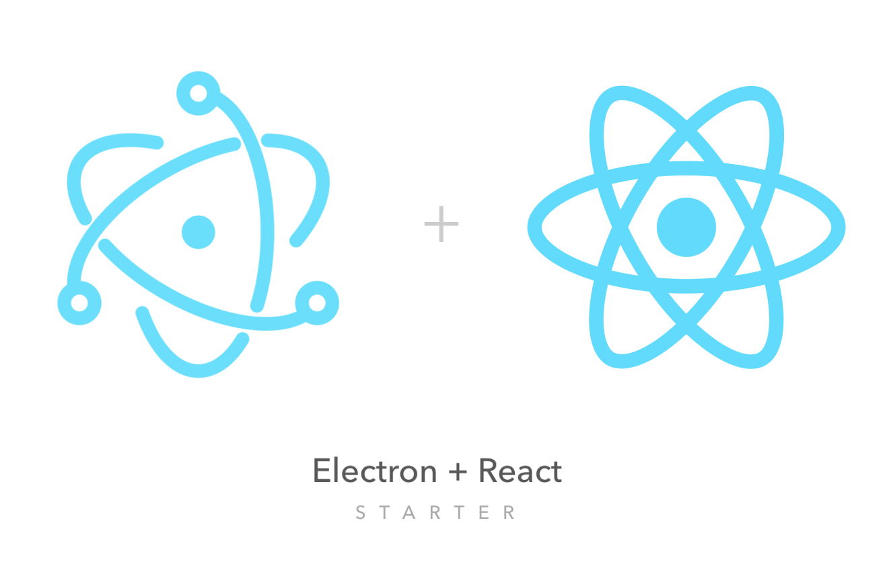

<p align="center">
  <a href="https://electronjs.org/">
    
  </a>
</p>
<h1 align="center">
  Electron + ReactJS Starter
</h1>
<p align="center">
  Electron starter with ReactJS that uses Parcel as a bundle along with additional set of tools listed bellow, and provides an easy to start structure to get you up and running with your Electron powered app.
</p>

##  What's inside?

- Electron (v22)
- Parcel
- ReactJS (v18)
- React Hot Loader
- Styled Components (v5)
- Styled Reset (Advanced)
- Eslint

## Quick start
```bash
$ git clone --depth 1 https://github.com/markoradak/electron-starter-reactjs-parcel my-awesome-app

$ cd my-awesome-app

$ git remote rm origin
$ git remote add origin https://github.com/user/repo.git

$ yarn
$ yarn start
```

## License

Licensed under the MIT License, Copyright © 2018 Marko Radak.  
See [license](LICENSE) for more information.